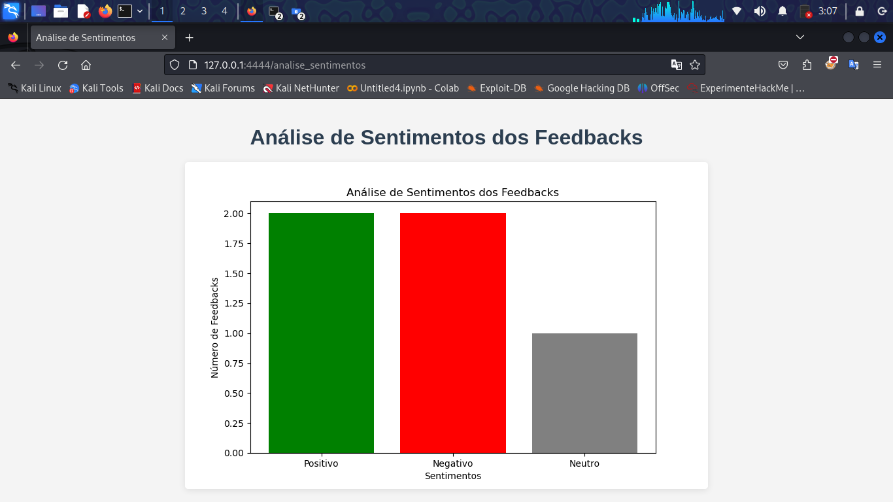

# CAF VISION SYNC - Plataforma de Feedback

**CAF VISION SYNC** é uma plataforma de feedback para o **CAF** (Colégio Arvore da Felicidade), onde os estudantes podem registrar seus feedbacks sobre as atividades escolares , professores ou qualquer outro funcionário da instituição

## Funcionalidades

- **Cadastro de Estudantes**: Estudantes podem se cadastrar em duas etapas.
- **Login**: Estudantes podem acessar o sistema com email e senha.
- **Registro de Feedbacks**: Estudantes podem registrar seus feedbacks sobre a escola.
- **Análise de Sentimentos**: O sistema utiliza a **Google Generative AI** para classificar o sentimento do feedback como **Positivo**, **Negativo** ou **Neutro**.
- **Visualização de Gráficos**: Exibe gráficos com a contagem de sentimentos dos feedbacks registrados.

## Tecnologias Utilizadas

- **HTML**: Para o Front-End.
- **CSS**: Estilização do sistema.
- **JavaScript**: Iteração com o usuário.
- **Flask**: Framework web para criar a aplicação.
- **SQLAlchemy**: ORM para interação com o banco de dados.
- **Google Generative AI**: API para análise de sentimentos.
- **Matplotlib**: Para gerar gráficos de análise de sentimentos.
- **SQLite**: Banco de dados utilizado para armazenar os dados.

## Estrutura do Projeto

- **app.py**: Arquivo principal com as rotas e lógica da aplicação.
- **templates/**: Diretório com os arquivos HTML para as páginas da aplicação.
- **static/**: Diretório para arquivos estáticos, como imagens (inclusive o gráfico gerado da análise de sentimentos).

## Instalação

1. Clone o repositório:

   ```bash
   git clone https://github.com/C0nqu14/caf-vision-sync.git
   cd CAF-VISION-SYNC
   ```

2. Instale as dependências necessárias:

   ```bash
   pip install -r requirements.txt
   ```

3. Configure a chave da API da Google:

   - Crie um projeto na [Google Cloud Console](https://console.cloud.google.com/).
   - Habilite a **Google Generative AI API**.
   - Gere a chave de API e substitua no código da aplicação.

4. Crie o banco de dados:

   Execute a aplicação uma vez para gerar o banco de dados:

   ```bash
   python app.py
   ```

   Isso criará o banco de dados SQLite necessário para a aplicação.

5. Inicie a aplicação:

   ```bash
   python app.py
   ```

   A aplicação estará disponível em [http://localhost:4444](http://localhost:4444).

## Como Usar

1. Acesse o sistema e se cadastre como estudante através do **Cadastro**.
2. Após o cadastro, faça login com seu email e senha.
3. Na área de feedback, registre seu feedback sobre as atividades.
4. O sistema realizará uma análise de sentimento do seu feedback e o salvará no banco de dados.
5. Acesse a página de **Análise de Sentimentos** para visualizar um gráfico com a distribuição dos sentimentos dos feedbacks registrados.

## Gráfico de Análise de Sentimentos

Abaixo está um exemplo do gráfico gerado com base nos feedbacks dos estudantes:



O gráfico mostra a distribuição de sentimentos dos feedbacks recebidos, incluindo:

- **Positivo**: Feedbacks com sentimento positivo.
- **Negativo**: Feedbacks com sentimento negativo.
- **Neutro**: Feedbacks com sentimento neutro.

## Exemplos de Rotas

### Cadastro de Estudante

- **GET** `/cadastro_estudante1`: Página para cadastrar informações básicas.
- **POST** `/cadastro_estudante1`: Envia as informações do estudante e redireciona para a segunda etapa de cadastro.
  
### Login

- **GET/POST** `/login`: Página de login para estudantes cadastrados.

### Feedback

- **GET/POST** `/feedback`: Página onde o estudante pode registrar seu feedback.

### Análise de Sentimentos

- **GET** `/analise_sentimentos`: Página que exibe o gráfico com a contagem dos sentimentos dos feedbacks.

## Licença

Este projeto está licenciado sob a MIT License - veja o arquivo [LICENSE](license.txt) para mais detalhes.
